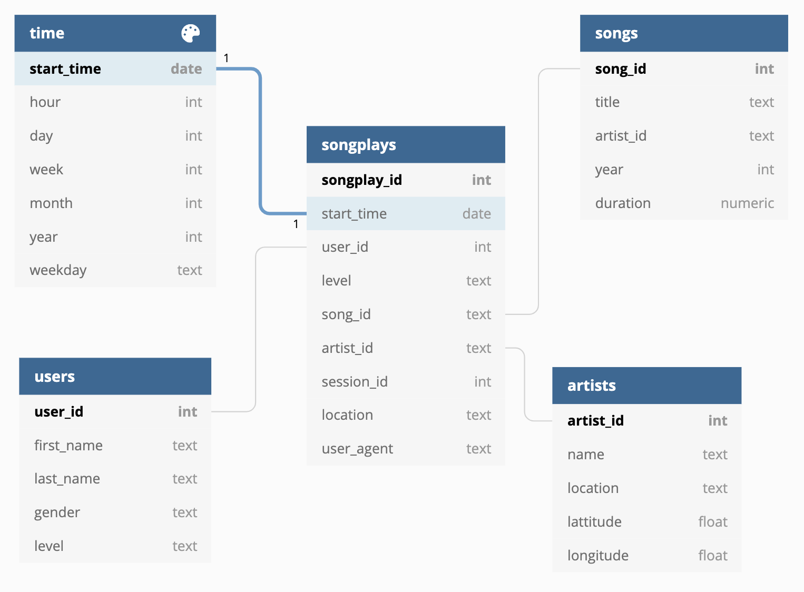

# ETL Process for creating Sparkify Database
## Project Overview.
## Project Repository files.
## Database Design.
This is the schema for the database. 
## ETL Process (pipeline).
## How To Run the Project