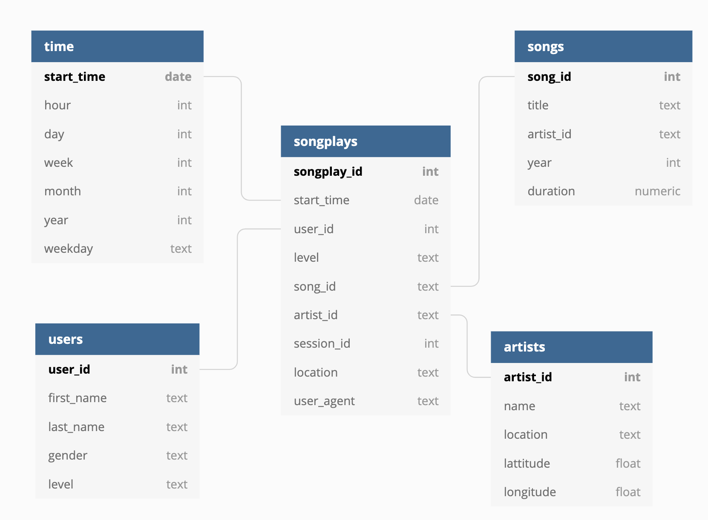

# ETL Process for creating Sparkify Database
This project consist of the following concepts:
- Data modeling with Postgres SQL database.
- Database star schema creation
- ETL pipeline using python
## Project files.
The following files are listed as being required for the code to run.
- etl.py
- create_table.py
- sql_queries.py
- data/ **this the data directory**
- venv/ **enviroment file**

It should be noted that etl.ipynb and test.ipynb are optional for the code to run.
## Database Design.
In this particular database it was decided to use a SQL database since we know the business requirements wont' be changing often.
 The best choice was to use a star schema and keep things simple where the songplay table is the fact table and the dimension tables are the users, songs, time and artists.
 
## ETL Process (pipeline).
0. Drop all existing database tables of Songs, Artists, Songplays, Users, and Time tables in Sparkifysdb.
1. Create Sparkifydb database and tables for the database.
2. Loads songs json files in data/song.
3. Then Extract, Transforms, and Loads into tables.
4. Next the algorithm loads the log files in data/log.
5. Repeats the ETL process and places them in the correct table.
## How To Run the Project
1. In the directory there is virtual environment named venv. Activate it and run `. venv/bin/activate`.
2. Then run `python create_tables.py` to create the tables first.
3. Run `python etl.py`. This load the json files and load them into the created tables.
4. (Optional) is run the test.ipynb notebook to check if all the tables were created properly. 

#### Created by [Eduardo Carrasco Jr](https://www.linkedin.com/in/eduardo-carrasco-99314990/)